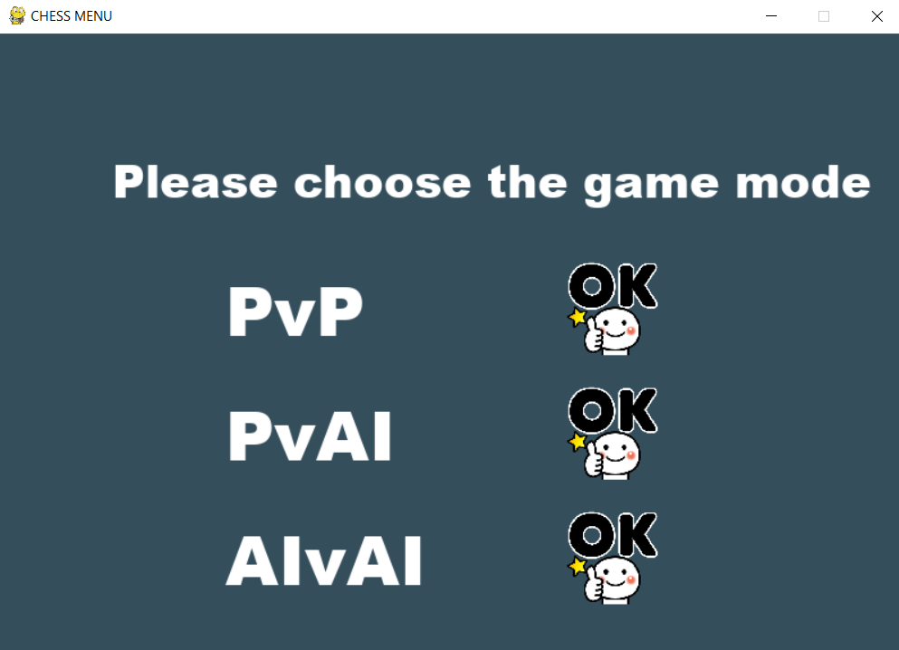
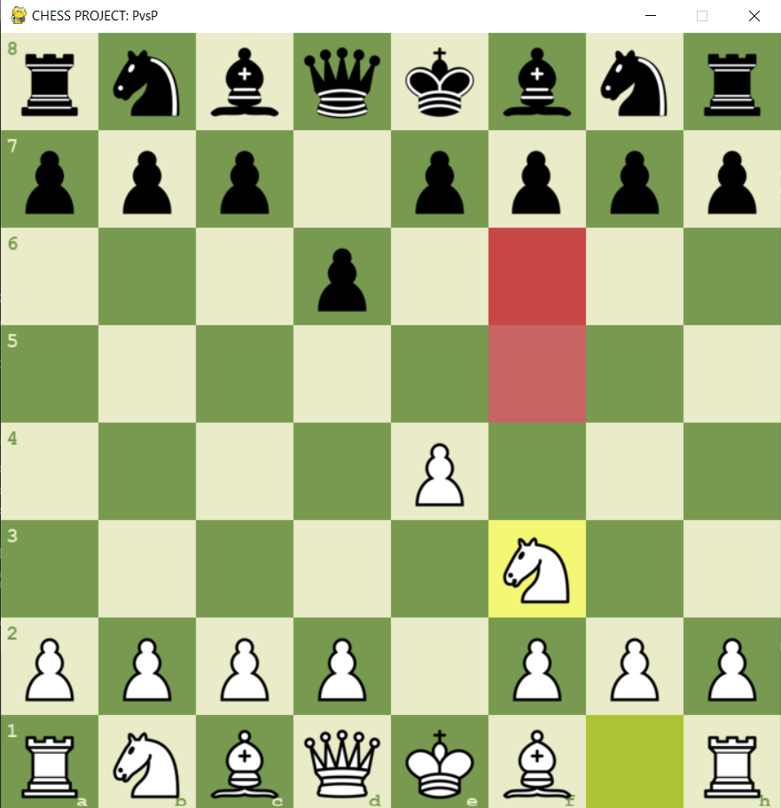

# Chess Project with simple AI 

**Python-based Chess Game with Multiple Modes**

---

## Table of Contents
1. [Introduction](#introduction)
2. [How to Use](#how-to-use)
3. [Libraries](#libraries-used)
---

## <a name="introduction"></a> Introduction

This simple project implements a chess game using Python with three different modes of play:

- **Player vs Player (PvsP)**: Two human players can play against each other.
- **Player vs AI (PvsAI)**: One player can challenge the computer, which is controlled by an AI algorithm.
- **AI vs AI (AI vs AI)**: Watch two AI opponents play against each other automatically.

AI Algorithm:
For the **Player vs AI** and **AI vs AI** modes, we implemented the AI using the **Minimax algorithm**

---

## <a name="how-to-use"></a> How to Use


- To start the chess game, run the `MENU.py` file. This will launch the main menu where you can select the desired gameplay mode.
- Three modes of gameplay:
1. **Player vs Player (PvsP)**: Two human players can play against each other on the same device.
2. **Player vs AI (PvsAI)**: One player can challenge the computer, which is controlled by an AI algorithm.
    - Press **B** to play as Black or **W** to play as White.
3. **AI vs AI (AI vs AI)**: Watch two AI players compete automatically.
    - Press between numbers **2**, **3**, **4**, or **5** to set the Minimax depth for the AI playing as White.
    - Similarly, press numbers **2**, **3**, **4**, or **5** to set the Minimax depth for the AI playing as Black.




## <a name="libraries"></a> Libraries Used

```python
import numpy as np
import chess
import random
import pygame "# Chess-Project-with-simple-AI-" 
# Chess-Project-with-simple-AI-
